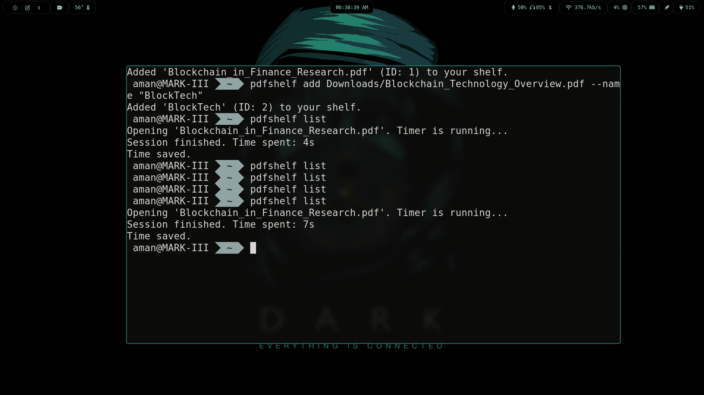
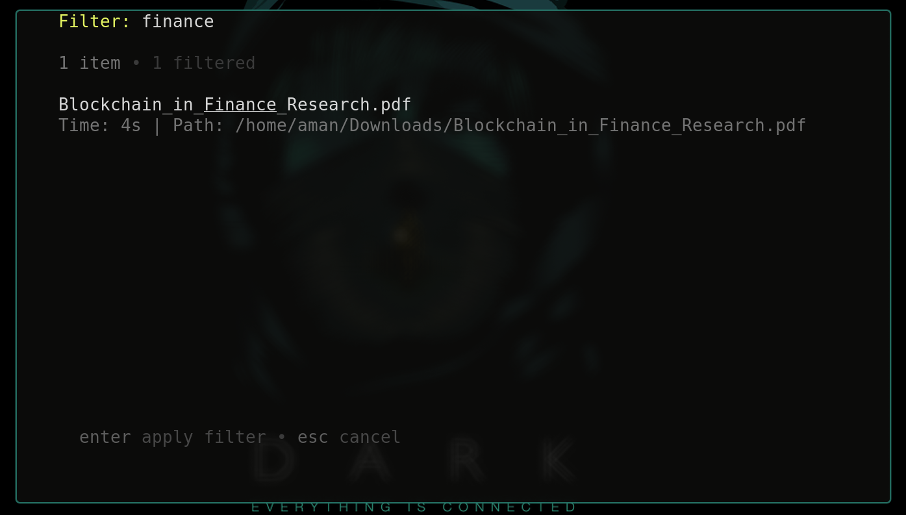
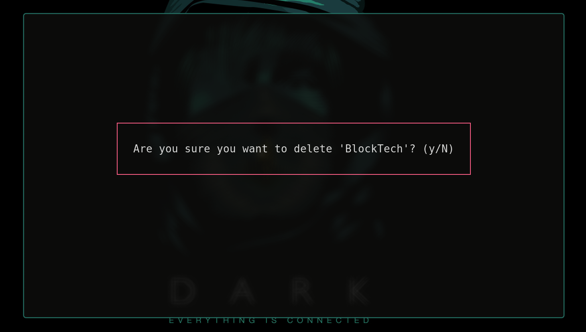
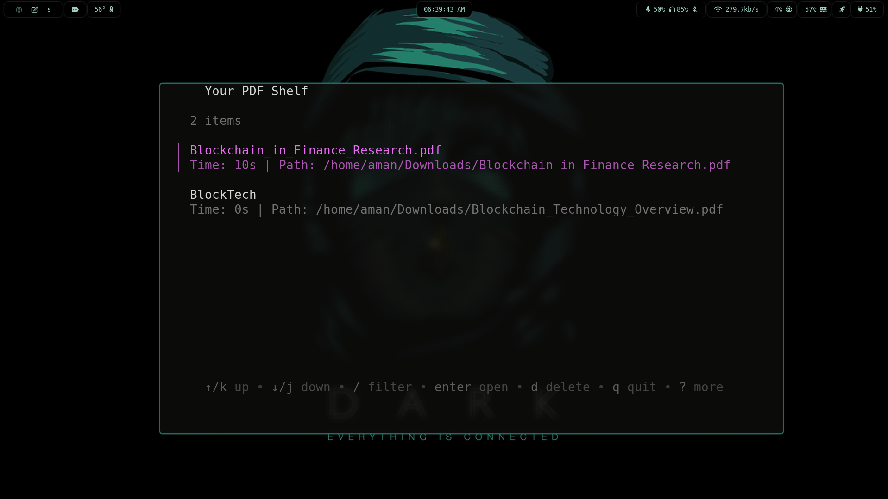

# 📚 pdfshelf

`pdfshelf` is a fast, interactive command-line utility for managing your PDF library. It launches a Terminal User Interface (TUI) that lets you browse, search, open, and track your reading time for all your PDFs without ever leaving the terminal.


## ✨ Features

* **Interactive TUI:** The default command `pdfshelf` (or `pdfshelf list`) launches a full-screen, searchable list of your PDFs.
* **Time Tracking:** Automatically tracks the time you spend reading each PDF.
* **Zathura Integration:** Opens PDFs directly in `zathura` (or your viewer of choice, eventually).
* **Fast & Simple:** Built in Go with `cobra` and `bubbletea`.
* **Easy Management:** Simple commands to add, remove, and open files by ID.

## 🖥️ Screenshots

### 1. Overview of the pdfshelf TUI


This screenshot shows the main interface of **pdfshelf**, where you can browse and navigate your PDF library.


### 2. Searching and Filtering PDFs


Here, you can see the **search and filter** feature in action, helping users quickly find specific PDFs in the library.


### 3. Deleting a PDF with Confirmation


This shows the **delete confirmation prompt** that ensures users don’t accidentally remove PDFs from their library.


### 4. Tracking Reading Progress


This screenshot demonstrates the **reading progress tracking** feature that lets you keep tabs on how much of a PDF you’ve read.


## 🚀 Installation

### Prerequisites

* [Go](https://go.dev/doc/install) (1.21 or later)
* `zathura`

### From Source

You can build and install the latest version from source:

```bash
git clone https://github.com/gsamansharma/pdfshelf.git
cd pdfshelf
go build
sudo mv pdfshelf /usr/local/bin/
```

Or install directly:

```bash
go install github.com/gsamansharma/pdfshelf@latest
```

## 💻 Usage

pdfshelf is designed to be run interactively. Simply run the main command to launch the TUI.

```bash
pdfshelf
```

This is the same as running `pdfshelf list`.

### TUI Keybindings

Once the TUI is open, you can use these keys:

* `enter`: Open the selected PDF.
* `d`: Delete the selected PDF (with a confirmation).
* `q` / `ctrl+c`: Quit the application.
* `/` or any text: Start filtering/searching the list.
* `↑` / `k`: Move cursor up.
* `↓` / `j`: Move cursor down.

### CLI Commands

You can also manage your library directly from the command line.

#### Add a PDF

```bash
# Add a PDF, using the filename as its name
pdfshelf add /path/to/my-book.pdf

# Add a PDF with a custom name
pdfshelf add /path/to/another-book.pdf --name "My Awesome Book"
pdfshelf add /path/to/notes.pdf -n "Class Notes"
```

#### Open a PDF by ID

If you know the ID from the list, you can open it directly.

```bash
pdfshelf open 3
```

#### Remove a PDF by ID

```bash
pdfshelf remove 5
```

## 📄 License

This project is licensed under the MIT License.

## 🤝 Contributing

Contributions are welcome! Feel free to open issues or submit pull requests.

## 👤 Author

**gsamansharma**

* GitHub: [@gsamansharma](https://github.com/gsamansharma)